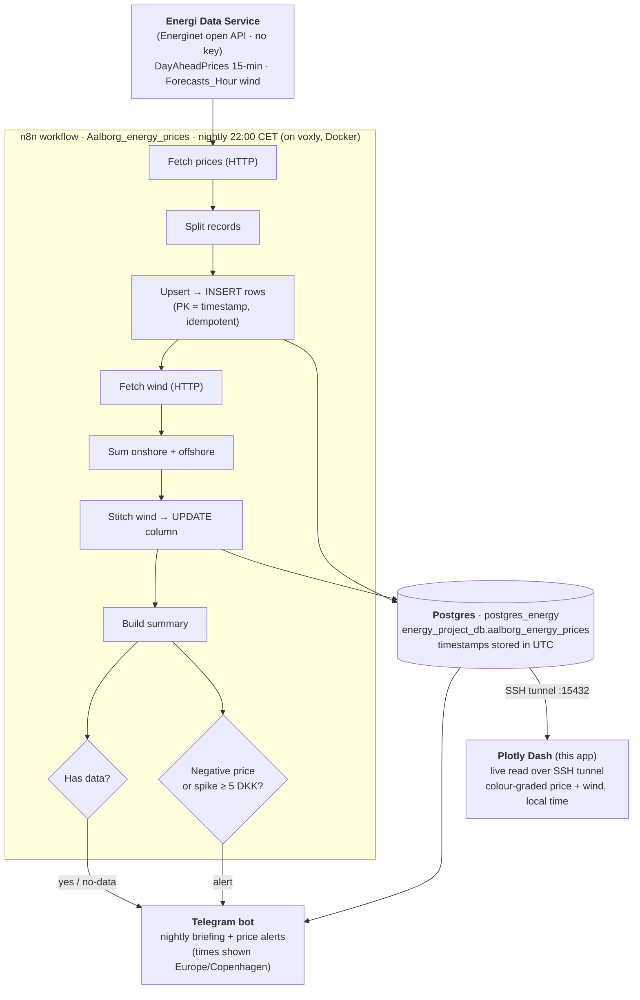

# Aalborg DK1 Energy Dashboard (Plotly Dash)

An interactive dashboard over DK1 day-ahead **electricity prices** and **wind
forecasts** for the Aalborg / DK1 bidding zone.

It is the visualisation end of a small end-to-end data pipeline I built: a
nightly **n8n** robot ingests Denmark's official grid data into **Postgres**,
then two consumers read from it — a **Telegram** bot that pushes a nightly
briefing + price alerts, and this **Plotly Dash** app for interactive
exploration. One data source, two delivery channels.

---

## End-to-end pipeline



**Lifecycle in one line:** `source → ingest → store → transform → visualise / alert`.

### Why prices and wind run *sequentially*, not in parallel
The price branch **INSERTs** the rows (keyed on `timestamp`); the wind branch
then **UPDATEs** a column on those same rows. Wind can only update rows that
already exist, so the two passes are chained — running them in parallel would
race and silently drop the wind data. One table, two write passes: prices
create the rows, wind fills a column. The upsert is idempotent (re-runnable),
and the nightly fetch uses a rolling multi-day window so a missed night
auto-corrects on the next run.

---

## The dashboard

- **Live data** from the energy Postgres over an SSH tunnel, with a CSV snapshot
  fallback if the DB is unreachable (the footer shows which source is active).
- **Daily briefing panel** mirroring the Telegram night-briefing: colour-graded
  price bars (green = cheap → red = pricey) with the wind forecast overlaid as a
  line, so you can *see* prices fall when the wind rises.
- **One single-day calendar** drives the whole page — pick a day and the
  briefing, the price chart, and the wind chart all reflect it.
- **Local time throughout.** Timestamps are stored in UTC but the market day
  (and the Telegram briefing) run on **Europe/Copenhagen** wall-clock, so the
  data layer converts on load — keeping the dashboard and the bot in lock-step.

## Run it

```bash
# 1) open the SSH tunnel to the energy Postgres (keep this terminal open)
ssh -L 15432:localhost:5432 -N voxly

# 2) in another terminal
cd energy_dash
python3 -m venv .venv          # first time only
source .venv/bin/activate
pip install -r requirements.txt
python app.py
```

Then open http://127.0.0.1:8050

If the tunnel isn't up, the app still runs on the CSV snapshot fallback.

## Data

- **Live:** `load_data()` reads from Postgres using `ENERGY_DB_URL` in `.env`
  (git-ignored). The URL points at `localhost:15432`, forwarded to the
  `postgres_energy` container by the SSH tunnel above.
- **Fallback:** `data/energy_prices.csv`, a snapshot exported with (fill in your
  own DB user / name):

  ```bash
  ssh voxly "docker exec postgres_energy psql -U <DB_USER> -d <DB_NAME> -c \
    \"\copy (SELECT timestamp, price_dkk_kwh, wind_forecast_mw FROM aalborg_energy_prices ORDER BY timestamp) TO STDOUT WITH CSV HEADER\"" \
    > data/energy_prices.csv
  ```

`.env` and the CSV are git-ignored.

> **Price transform:** the raw wholesale spot is converted to the consumer price
> a household actually pays: `price_dkk_kwh = SpotPriceDKK / 1000 * 1.25`
> (→ per kWh, incl. 25% VAT).

## Architecture note

All data access is isolated in `load_data()` in `app.py` (live DB → CSV
fallback), and the UTC→Copenhagen conversion happens once on load in
`_finalize()`. A single `DatePickerSingle` drives one `render` callback that
produces the entire page (briefing summary + detail price/wind charts), so there
are no callback loops and one control is the single source of truth for the date.
